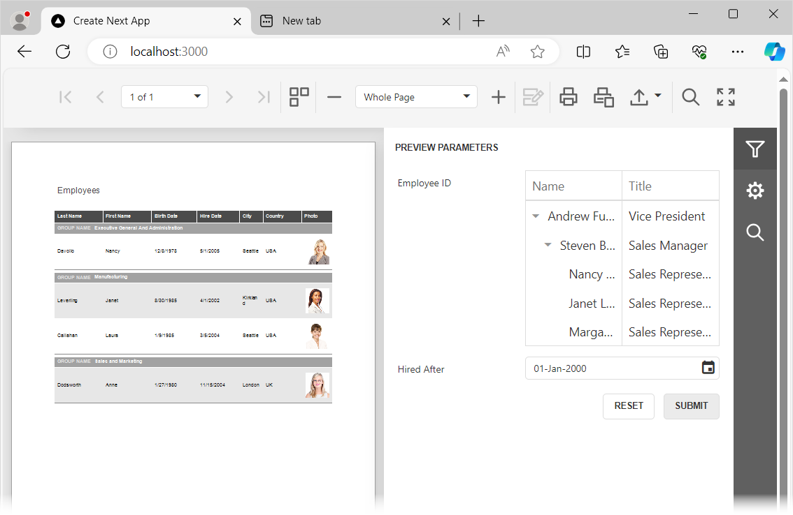

<!-- default badges list -->
[](https://supportcenter.devexpress.com/ticket/details/T1234782)
[](https://docs.devexpress.com/GeneralInformation/403183)
<!-- default badges end -->
# Reporting for React - Customize Parameter Editor in the Web Document Viewer

This example demonstrates two approaches to the parameter editor customization:
- Specify editor options for a default parameter editor
- Use a template to replace a default editor for a specific parameter type with a custom editor



## Quick Start 

### Server

In the *backend* folder, run the following command:

```
dotnet run
```

The server starts at `http://localhost:5000`. To debug the server, run the application in Visual Studio.

### Client

In the *react-document-viewer* folder, run the following commands:

```
npm install
npm run dev
```

Open `http://localhost:3000/` in your browser to view the result. 

## Implementation details

### Use Custom Editor Template

Use the DevExtreme [TreeList](https://js.devexpress.com/React/Documentation/Guide/UI_Components/TreeList/Getting_Started_with_TreeList/) component as a template for the *Employee ID* parameter's value editor:

```ts
const CustomParameterEditor = ({data}: {data: IEditorViewModel}) => {
    const dataSource = `${BACKEND_URL}/Home/ListEmployees`;
    const columns = [{ dataField: "name", caption: "Name" }, { dataField: "title", caption: "Title" }];

    const onSelectionChanged = (e: any) => {
      if (e.selectedRowsData.length > 0) {
        var selectedEmployeeID = e.selectedRowsData[0].id;
        parametersModel.p_employeeID = selectedEmployeeID;
      }
    }

  return (
      <TreeList
          dataSource={dataSource}
          columns={columns}
          showBorders={true}
          selection={{ mode: 'single' }}
          selectedRowKeys={data.value}
          onSelectionChanged={onSelectionChanged}
      />
  );
};
```

To register the template, pass the template name and the template itself to the `templateEngine.setTemplate` method:

```ts
templateEngine.setTemplate('employeeID-custom-editor', CustomParameterEditor);
```

In the `CustomizeParameterEditors` event handler, set the [header](https://docs.devexpress.com/XtraReports/js-DevExpress.Analytics.Utils.IEditorInfo?p=netframework#js_devexpress_analytics_utils_ieditorinfo_header) property to the template name for the *p_employeeID* parameter:

```ts
const onCustomizeParameterEditors = React.useCallback(({ args }: { args: any }): void => {
      if (args.parameter.name == "p_employeeID") {
          args.info.editor = { header: 'employeeID-custom-editor' };
      };
  }, []);
```

### Customize Standard Editor

Use the `CustomizeParameterEditors` event to change the display format and set validation rules for parameters of the `System.DateTime` type:
- Use the [extendedOptions](https://docs.devexpress.com/XtraReports/js-DevExpress.Analytics.Utils.IEditorInfo?p=netframework#js_devexpress_analytics_utils_ieditorinfo_extendedoptions) property to specify display format in the value editor.
- Use the [validationRules](https://docs.devexpress.com/XtraReports/js-DevExpress.Analytics.Utils.ISerializationInfo?p=netframework#js_devexpress_analytics_utils_iserializationinfo_validationrules) property to set the rules to validate the  value entered in the editor.

```ts
const onCustomizeParameterEditors = React.useCallback(({ args }: { args: any }): void => {
    if (args.parameter.type === 'System.DateTime') {
        args.info.editor = {...args.info.editor};
        args.info.editor.extendedOptions = {
            ...args.info.editor.extendedOptions,
            type: 'date',
            displayFormat: 'dd-MMM-yyyy'
        };
        args.info.validationRules = [{
            type: "range",
            min: new Date(1990, 0, 1),
            message: "No data available prior to the year 1990."
        }];
    };
}, []);
```

## Files to Review

- [page.tsx](react-document-viewer/src/app/page.tsx)
- [HomeController.cs](backend/Controllers/HomeController.cs)

## Documentation

- [Reporting for React](https://docs.devexpress.com/XtraReports/119338)

## More Examples

- [Reporting for React - Add a Web Document Viewer to a React App](https://github.com/DevExpress-Examples/reporting-react-integrate-web-document-viewer)
- [Reporting for React - Customize Viewer Toolbar](https://github.com/DevExpress-Examples/reporting-react-customize-viewer-toolbar)
